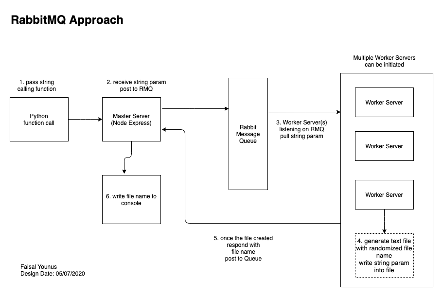

# API-Challenge

## Install Steps
1. Install RabbitMQ: https://www.rabbitmq.com/install-homebrew.html
2. NPM install in each folder

# Python folder
### HTML file
Contains an index.html file to invoke Master Server.  Run it with LiveServer in VS Code
### Wrapper Function
There is a wrapper node function, this could be run to execute a node get request to initiate Master Server

# Logical Diagram
