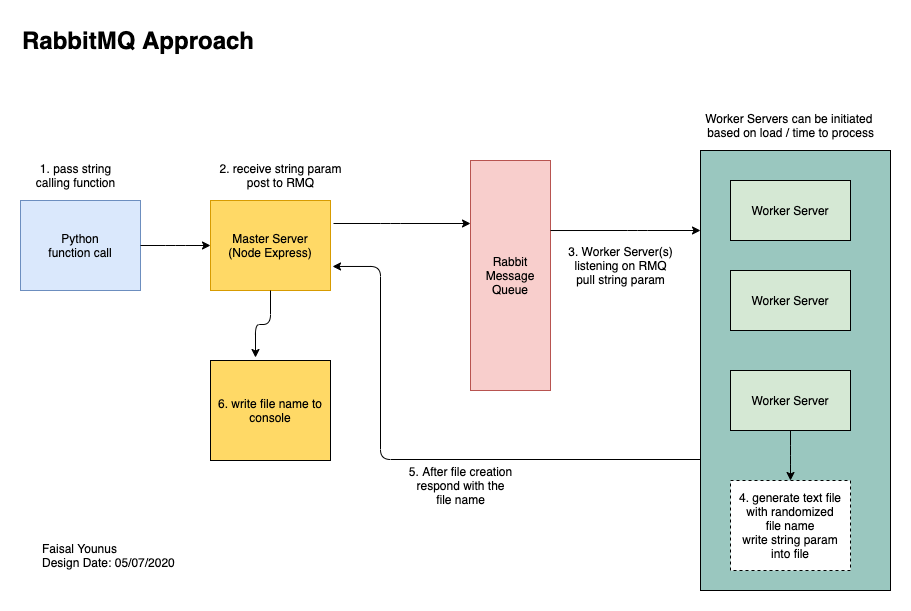

# API-Challenge

Demonstrating distributed development using Calling function (Python), Rest API (MasterServer), Queue (RabbitMQ), and Worker Service (WorkerServer).

## Basic flow:

The original challenge design was to utilize sockets in a basic flow as shown below.

Python -> MasterServer ->RabbitMQ -> WorkerServer

## Enhanced Design

I enhanced the design by utilizing a queue service to enable better throughput and lower latency by enabling multiple WorkerServers.  

In testing I was able to demonstrate RabbitMQ will distribute the load in round-robin to the multiple WorkerServers.

## Install Steps  

1. Install RabbitMQ: https://www.rabbitmq.com/install-homebrew.html
2. Run 'npm install' in each folder (Python, MasterServer, WorkerServer)

## Start RabbitMQ

To start RabbitMQ run the below command in terminal

`brew services start rabbitmq`

To verify it is working browse to http://localhost:15672/#/queues

## Run Python (node)

In the Python folder run the following in the terminal

`node wrapperfunction.js` 

## Run Python (html)

1. In the Python folder run index.html through VS Code by running it with LiveServer.
2. It will bring up an html form that will allow for inputting a string param
3. Click submit to exexute the call to MasterServer

## Run MasterServer

In the MasterServer folder run the folling in the terminal

`node app.js`

## Run WorkerServer

In the WorkerServer folder run the folling in the terminal

`node worker.js`

